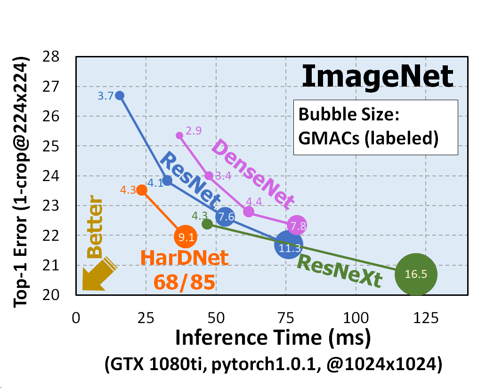
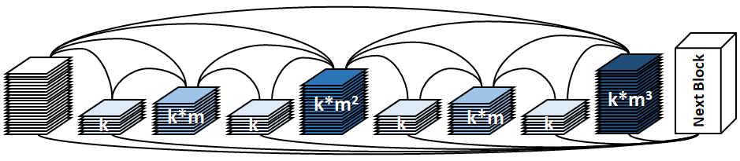

# Pytorch-HarDNet
### [Harmonic DenseNet: A low memory traffic network (ICCV 2019 paper)](https://arxiv.org/abs/1909.00948)
### See also [CenterNet-HarDNet](https://github.com/PingoLH/CenterNet-HarDNet) for Object Detection in 44.3 mAP / 45 fps on COCO dataset
### and [FC-HarDNet](https://github.com/PingoLH/FCHarDNet) for Semantic Segmentation
* Fully utilize your cuda cores!
* Unlike CNN models using a lot of Conv1x1 to reduce model size and number of MACs, HarDNet mainly uses Conv3x3 (with only one Conv1x1 layer for each HarDNet block) to increase the computational density.
* Increased computational density changes a model from Memory-Bound to Compute-Bound
<br>
<p align="center">
  
</p>

## Architecture
#### HarDNet Block:
- k = growth rate (as in DenseNet)
- m = channel weighting factor (1.6~1.7)
- Conv3x3 for all layers (no bottleneck layer)
- Conv-BN-ReLU for all layers intead of BN-ReLU-Conv used in DenseNet
- See [MIPT-Oulu/pytorch_bn_fusion](https://github.com/MIPT-Oulu/pytorch_bn_fusion) to get rid of BatchNorm for inference.
- No global dense connection (input of a HarDBlk is NOT reused as a part of output)
<p align="center">
  
</p>

#### HarDNet68/85:
- Enhanced local feature extraction to benefit the detection of small objects
- A transitional Conv1x1 layer is employed after each HarDNet block (HarDBlk)
<p align="center">
  
</p>

## Results

| Method | MParam | GMACs | Inference <br>Time* | ImageNet <br>Top-1 | COCO mAP <br>with SSD512 | 
| :---: | :---:  | :---:  | :---:  | :---:  | :---:  | 
| **HarDNet68**   | 17.6 | 4.3  | 22.5 ms | 76.5 | 31.7 | 
| ResNet-50  | 25.6  | 4.1 | 31.0 ms | 76.2 | - |
| **HarDNet85**   | 36.7 | 9.1  | 38.0 ms | 78.0 | 35.1 | 
| ResNet-101 | 44.6  | 7.8 | 51.2 ms | 78.0 | 31.2 |
| VGG-16  | 138  | 15.5 | 49 ms | 73.4 | 28.8 | 

\* Inference time measured on an NVidia 1080ti with pytorch 1.1.0\
300 iteraions of random 1024x1024 input images are averaged.


## Results of Depthwise Separable (DS) version of HarDNet

| Method | MParam | GMACs | Inference <br>Time** | ImageNet <br>Top-1 | 
| :---: | :---:  | :---:  | :---:  | :---:  | 
| **HarDNet39DS** | 3.5  | 0.44 | 32.5 ms | 72.1 | 
| MobileNetV2  | 3.5  | 0.3 | 37.9 ms | 72.0 | 
| **HarDNet68DS** | 4.2  | 0.8  | 52.6 ms | 74.3 | 
| MobileNetV2 1.4x  | 6.1  | 0.6 | 57.8 ms | 74.7 | 

\** Inference time measured on an NVidia Jetson nano with TensorRT\
500 iteraions of random 320x320 input images are averaged.

## Train HarDNet models for ImageNet

Training prodedure is branched from https://github.com/pytorch/examples/tree/master/imagenet

Training:
```
python main.py -a hardnet68 [imagenet-folder with train and val folders]

arch = hardnet39ds | hardnet68ds | hardnet68 | hardnet85
```

Evaluating:
```
python main.py -a hardnet68 --pretrained -e [imagenet-folder with train and val folders]
```
for HarDNet85, please download pretrained weights from [here](https://drive.google.com/file/d/1I-qbZtpVlWbRyz1c3lT7rg2IqxCl28at/view?usp=sharing)

### Hyperparameters
- epochs 150 ~ 250
- initial lr = 0.05
- batch size = 256
- weight decay = 6e-5
- cosine learning rate decay
- nestrov = True
