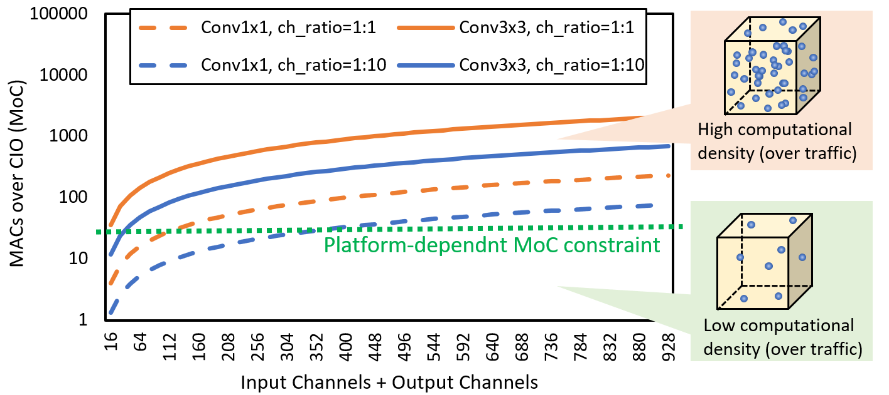

# Pytorch-HarDNet
### Harmonic DenseNet: A low memory traffic network (ICCV 2019)
### ~ Fully utilize your cuda cores ~

#### Unlike CNN models using a lot of Conv1x1 to reduce model size and number of MACs, HarDNet mainly uses Conv3x3 (with only one Conv1x1 layer for each HarDNet block) to increase the computational density.
#### Increased computational density changes a model from Memory-Bound to Compute-Bound
 

  

#### HarDNet Block:
- k = groth rate (as in DenseNet)
- m = channel multiply factor (1.6~1.7)

  

## Results

| Method | MParam | GMACs | Inference  Time* | ImageNet  Top-1 | COCO mAP  with SSD512 | 
| :---: | :---:  | :---:  | :---:  | :---:  | :---:  | 
| **HarDNet68**   | 17.6 | 4.3  | 22.5 ms | 76.5 | 31.7 | 
| ResNet-50  | 25.6  | 4.1 | 31.0 ms | 76.2 | - |
| **HarDNet85**   | 36.7 | 9.1  | 38.0 ms | 78.0 | 35.1 | 
| ResNet-101 | 44.6  | 7.8 | 51.2 ms | 78.0 | 31.2 |
| VGG-16  | 138  | 15.5 | 49 ms | 73.4 | 28.8 | 

\* Inference time measured on an NVidia 1080ti with pytorch 1.1.0\
300 iteraions of random 1024x1024 input images are averaged.

## Results of Depthwise Separable (DS) version of HarDNet

| Method | MParam | GMACs | Inference  Time** | ImageNet  Top-1 | 
| :---: | :---:  | :---:  | :---:  | :---:  | 
| **HarDNet39DS** | 3.5  | 0.44 | 32.5 ms | 72.1 | 
| MobileNetV2  | 3.5  | 0.3 | 37.9 ms | 72.0 | 
| **HarDNet68DS** | 4.2  | 0.8  | 52.6 ms | 74.3 | 
| MobileNetV2 1.4x  | 6.1  | 0.6 | 57.8 ms | 74.7 | 

\** Inference time measured on an NVidia Jetson nano with TensorRT\
500 iteraions of random 320x320 input images are averaged.
