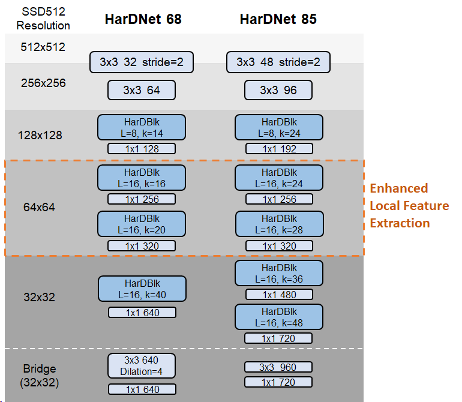

# SSD-512 with HarDNet as backbone

#### Please download and follow the instructions in https://github.com/lzx1413/PytorchSSD to setup the environment
#### This repo provides only HarDNet model files compatible with the above repo

HarDNet68/85: \
With enhanced feature extraction on high resolution feature maps, the performance on object detection can be better than models designed for image classification which generally concentrate on global feature extraction.
<p align="center">
  
</p>

## COCO Pretrained Weights
Please download COCO pretrained weights from the following links:\
[SSD-HarDNet68](https://drive.google.com/file/d/1IHXvQMsQbuwYbuxW7HjFQHhGSX6SKz70/view?usp=sharing)\
[SSD-HarDNet85](https://drive.google.com/file/d/1gagahaMFOKG6hOGpU0-CgL3m1yc13ktr/view?usp=sharing)

## Hyperparameters
- batch size = 32
- epochs = 150 (COCO) / 300 (VOC)
- initial lr = 4e-3
- lr decay by 0.1 at [60%, 80%, 90%] of total epochs
- weight decay = 1e-4 (COCO) / 5e-4 (VOC)


## Results
| Method | COCO mAP on test-dev | 
| :---: |  :---:  | 
| SSD512-VGG16  | 28.8 | 
| SSD513-ResNet101 | 31.2 |
| **SSD512-HarDNet68**   | **31.7** | 
| **SSD512-HarDNet85**   | **35.1** | 

SSD512-HarDNet68 detailed results:
```
overall performance
 Average Precision  (AP) @[ IoU=0.50:0.95 | area=   all | maxDets=100 ] = 0.317
 Average Precision  (AP) @[ IoU=0.50      | area=   all | maxDets=100 ] = 0.510
 Average Precision  (AP) @[ IoU=0.75      | area=   all | maxDets=100 ] = 0.338
 Average Precision  (AP) @[ IoU=0.50:0.95 | area= small | maxDets=100 ] = 0.125
 Average Precision  (AP) @[ IoU=0.50:0.95 | area=medium | maxDets=100 ] = 0.351
 Average Precision  (AP) @[ IoU=0.50:0.95 | area= large | maxDets=100 ] = 0.479
 Average Recall     (AR) @[ IoU=0.50:0.95 | area=   all | maxDets=  1 ] = 0.277
 Average Recall     (AR) @[ IoU=0.50:0.95 | area=   all | maxDets= 10 ] = 0.419
 Average Recall     (AR) @[ IoU=0.50:0.95 | area=   all | maxDets=100 ] = 0.439
 Average Recall     (AR) @[ IoU=0.50:0.95 | area= small | maxDets=100 ] = 0.184
 Average Recall     (AR) @[ IoU=0.50:0.95 | area=medium | maxDets=100 ] = 0.485
 Average Recall     (AR) @[ IoU=0.50:0.95 | area= large | maxDets=100 ] = 0.636
```


SSD512-HarDNet85 detailed results:
```
overall performance
 Average Precision  (AP) @[ IoU=0.50:0.95 | area=   all | maxDets=100 ] = 0.351
 Average Precision  (AP) @[ IoU=0.50      | area=   all | maxDets=100 ] = 0.548
 Average Precision  (AP) @[ IoU=0.75      | area=   all | maxDets=100 ] = 0.376
 Average Precision  (AP) @[ IoU=0.50:0.95 | area= small | maxDets=100 ] = 0.150
 Average Precision  (AP) @[ IoU=0.50:0.95 | area=medium | maxDets=100 ] = 0.389
 Average Precision  (AP) @[ IoU=0.50:0.95 | area= large | maxDets=100 ] = 0.515
 Average Recall     (AR) @[ IoU=0.50:0.95 | area=   all | maxDets=  1 ] = 0.301
 Average Recall     (AR) @[ IoU=0.50:0.95 | area=   all | maxDets= 10 ] = 0.454
 Average Recall     (AR) @[ IoU=0.50:0.95 | area=   all | maxDets=100 ] = 0.475
 Average Recall     (AR) @[ IoU=0.50:0.95 | area= small | maxDets=100 ] = 0.217
 Average Recall     (AR) @[ IoU=0.50:0.95 | area=medium | maxDets=100 ] = 0.528
 Average Recall     (AR) @[ IoU=0.50:0.95 | area= large | maxDets=100 ] = 0.673
 ```
